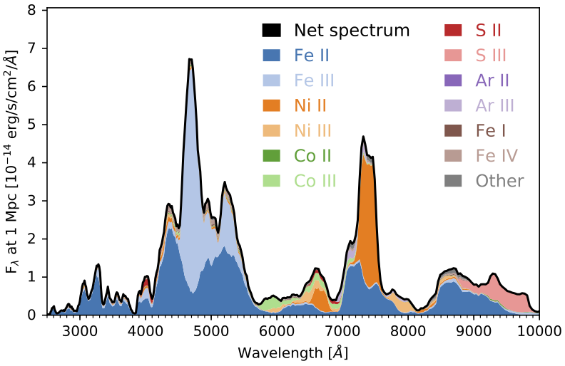
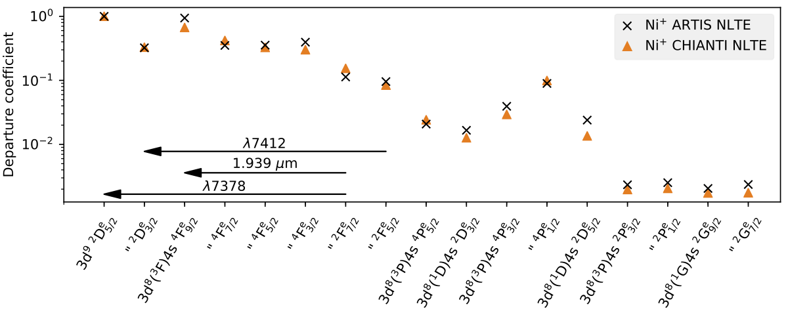
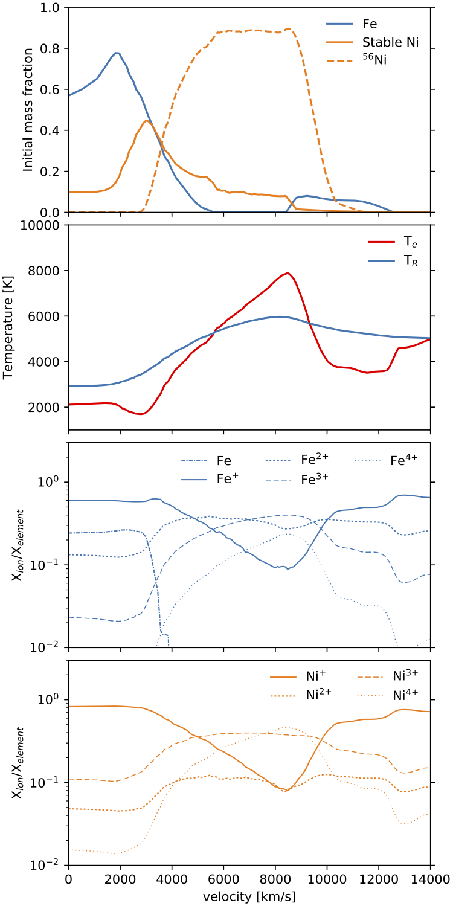

# Artistools

> Artistools is collection of plotting, analysis, and file format conversion tools for the [ARTIS](https://github.com/artis-mcrt/artis) radiative transfer code.


[](https://codecov.io/gh/artis-mcrt/artistools)
[](https://www.codefactor.io/repository/github/artis-mcrt/artistools)

## Installation
First clone the repository, for example:
```sh
git clone https://github.com/artis-mcrt/artistools.git
```
Then from the repo directory run:
```sh
pip install -e .
```

## Usage
Artistools provides commands including:
  - artistools-deposition
  - artistools-spencerfano
  - artistools-make1dslicefrom3dmodel
  - artistools-estimators
  - artistools-lightcurve
  - artistools-nltepops
  - artistools-nonthermal
  - artistools-radfield
  - artistools-spectrum
  - artistools-transitions

Use the -h option to get a list of command-line arguments for each subcommand. Most of these commands would usually be run from within an ARTIS simulation folder.

## Example output





## Meta

Distributed under the MIT license. See ``LICENSE`` for more information.

[https://github.com/artis-mcrt/artistools](https://github.com/artis-mcrt/artistools)


